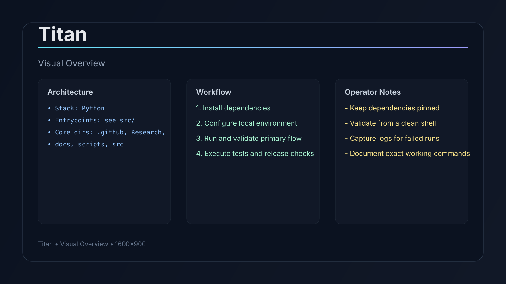

# AI Chat

Resilient local-first TUI agent harness with checkpointing and replay.

## Installation

1) Install Python 3.10+
```bash
python3 --version
```


2) Clone and enter the repo
```bash
git clone <repo-url>
cd <repo-name>
```

## Quick Start

```bash
python3 -m venv .venv
source .venv/bin/activate
pip install -r requirements.txt  # or pip install -e .
```

## Usage Examples

- Run locally
```bash
python -m <module_or_script>
```

- Run tests
```bash
pytest
```

- Launch TUI binary after build
```bash
./target/release/titan
```

## Implementation Overview

This repository is implemented primarily in **Python** and organized around explicit runtime entrypoints plus supporting modules.

### Key Directories

- `.github/`
- `Research/`
- `docs/`
- `scripts/`
- `src/`
- `tests/`

### Key Files

- `pyproject.toml`
- `README.md`
- `LICENSE`
- `.github/workflows/ci.yml`

### Entrypoints


## Troubleshooting

- If startup fails, run the primary command with verbose flags and capture stderr logs.
- If dependencies conflict, remove lock artifacts and reinstall in a clean shell.
- If tests fail intermittently, run a single test target first, then full suite.
- Ensure environment variables are loaded before running build/train commands.

## Visual Overview




## Problem
Agent workflows need reliability and recoverability, not just one-shot outputs.

## Reproducibility
```bash
python -m pip install -e .
titan
```

## Limits
Behavior depends on model/provider and local runtime constraints.
